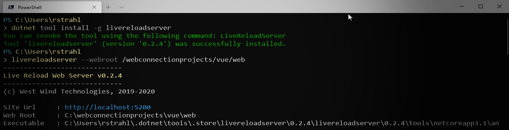
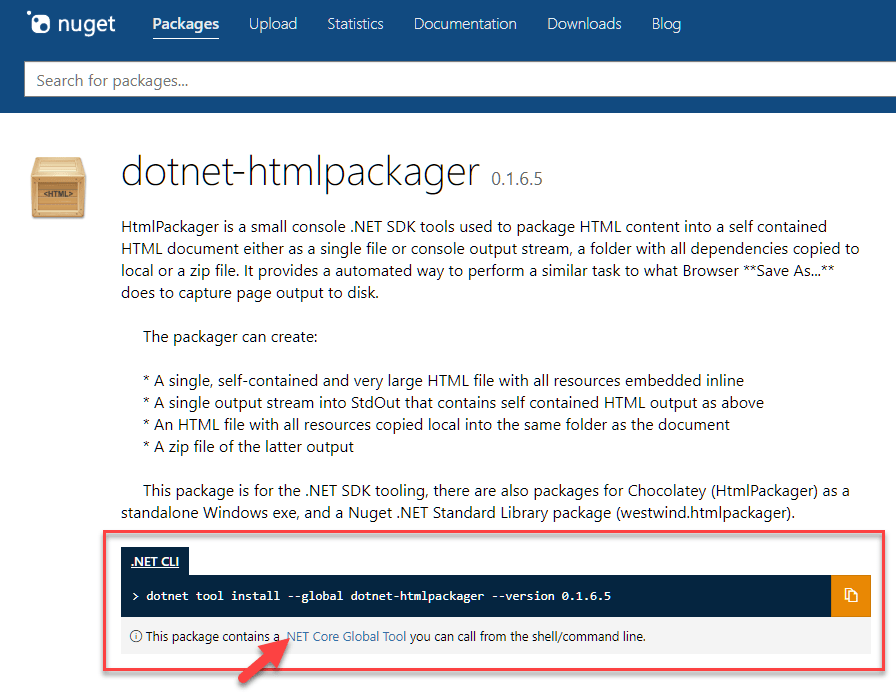
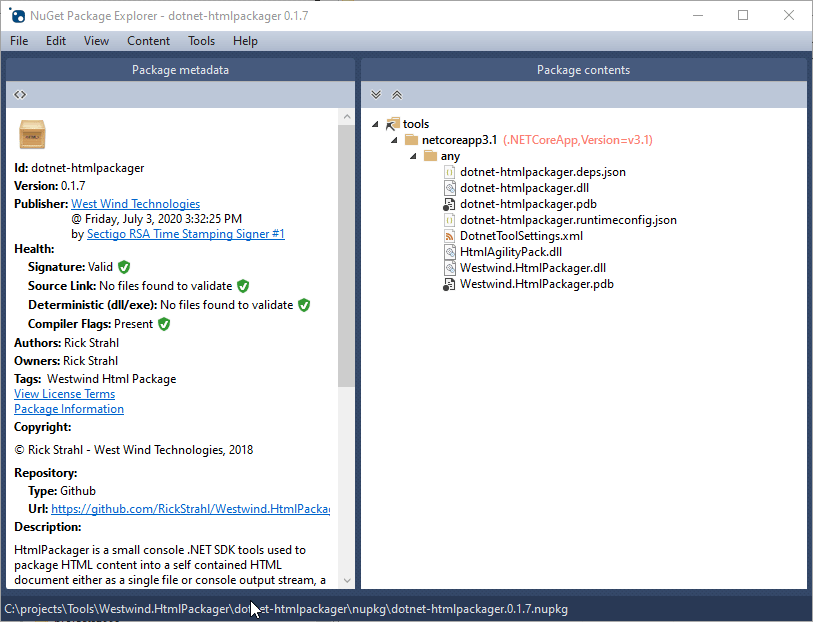
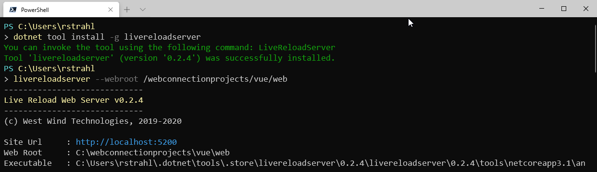
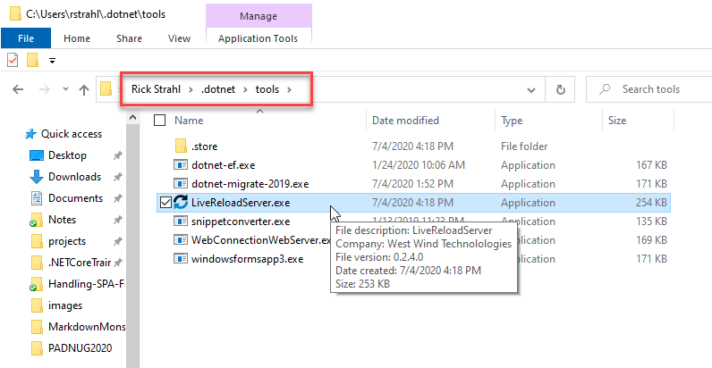
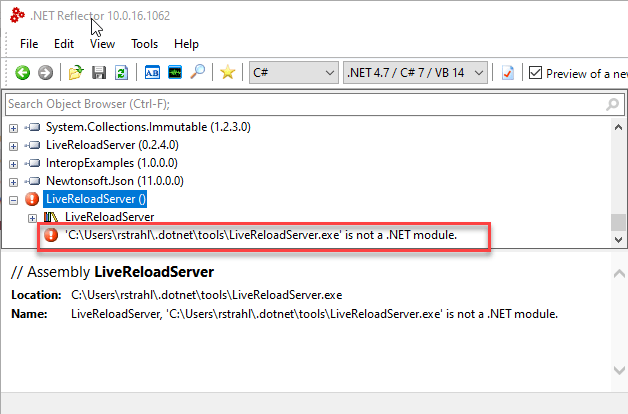
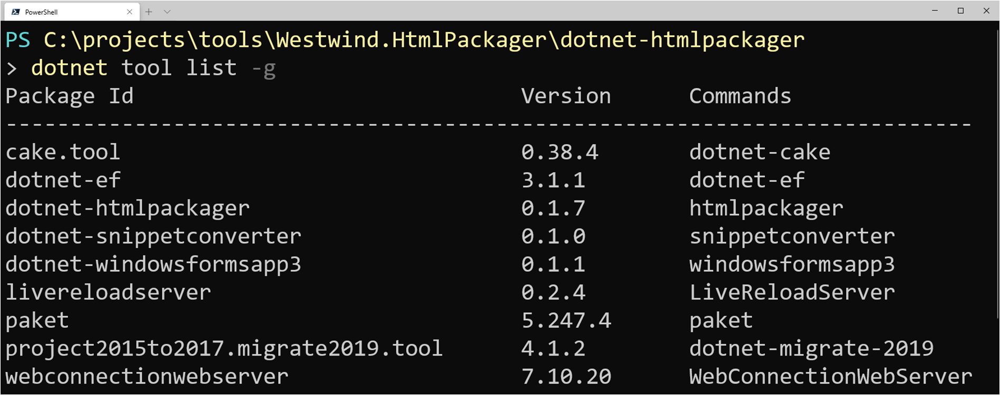

# Using .NETCore Tools to Create Reusable and Shareable Tools & Apps



Starting with .NET Core 2.1 Microsoft introduced the **Dotnet Tools** platform as part of the .NET Core SDK. 

Dotnet Tools are a simple way to create, publish and consume what are essentially .NET Core ~~Console~~ applications that can be published and shared using the existing NuGet infrastructure for packaging and distribution. This means it's really quick and easy to build tools that you can share either publicly or privately. 

## What is a Dotnet Tool?
When you break down what a Dotnet Tool is to its bare bones, it comes down to this simple statement:

> **“A Dotnet Tool is a glorified.NET Core ~~Console~~ Application that can be easily shared and installed via NuGet.”**
>
> *Me, 2020*

The idea of a Dotnet Tool is to make it easy to build, publish and consume executable tools in the same way you've been able create NuGet packages for .NET Core components in the past.

And while the original idea was to build tools to aid as part of the build process, this platform really offers much more scope because essentially **you can publish and share any .NET Core executable application**. This includes servers that run full ASP.NET Core applications or services as well as .NET Core desktop applications.

### Why use Dotnet Tools?
The big selling points of Dotnet Tools are:

* You can **build** a tool with a simple flag in your .NET Project file
* Tools are **cross platform** without requiring platform specific binaries    
<small>(Console applications only)</small>
* You can **publish** the tool to NuGet like any other NuGet Package
* There's **no package approval process**
* You can **install** a tool via `dotnet tool install`
* You can **update** and **uninstall** Dotnet Tools quickly

On the flip side there is the pre-requisite:

* The **.NET Core SDK is required** to run a Dotnet Tool

The SDK dependence is both a blessing and a curse: Because it's guaranteed that the .NET Core Runtime is installed, binaries can be very small and only consist of application specific files. 

But the .NET SDK is something that has to be installed and the SDK install is neither small, nor something that a typical, non development user will have installed, so either it has to be explicitly installed or you are explicitly targeting (.NET) developers with your tool.

The benefit is that you can **easily** publish tools using the existing NuGet tooling infrastructure and unlike other app or package stores dotnet tools don't require extensive validation. This means - packages are turned around very quickly and are often available mere minutes after having been published.

### There's nothing new under the Sun!

> ***“Did you just describe NPM?”***  
> Yup: Dotnet Tool is very much like NPM  for .NET Core.

If all this looks familiar from NodeJs and NPM - you're right. The idea is not new by any means, but certainly for .NET to be able to easily publish and share binary executable tools in a cross-platform manner is something new and exciting. 

### Benefits the .NET Eco System
While it's not anything new, this tooling does provide a number of benefits to developers and the entire .NET Core eco system.

**Easy to build**

* Uses standard .NET Core Projects
* Uses existing NuGet Infrastructure
* Nothing new to learn - works with existing tech

**Sharing**

* Can be easily shared
* Can reach a large pool of users

**Community**

* Ease of use and shareability promotes creation of tools
* Shared content helps build community


### What can you use Dotnet Tools For?
Although .NET Tools were initially designed to provide development time tools, compilation helpers, build tools and other things that you might need for the development process, it turns out that Dotnet Tools are basically just .NET Core executables and can do - well anything that a .NET Core executable can do. This means you can use it for all sorts of things that might not be directly developer related.

Built a small utility? Need to have an easy way for people to install and run it? Or simply share it amongst your team or maybe even with yourself on multiple machines? A Dotnet Tool requires minimum effort and no long-winded, store-like validation, so once you publish your tool will be avaible in a few minutes to consume.

Here are a few general use cases addressed by Dotnet Tools:

* **Build and Dev Time Tools**  
There are many tools that follow the original design goal for creating project helpers that make development tasks easier or facilitate external but related development operations. For example, tools like EF migration commands in `dotnet ef`, `dotnet watch run`, and the user secrets manager are all dotnet tools that fit this bill. There are many tools available in this category.

* **Generic Command Line Tools**  
If you need to build some complex commandline helpers that work on scenarios that are maybe somewhat more complex than what you reasonably want to do in Powershell or Bash, a tool can fit that niche nicely. Because these tools can be shared and installed easily and are generally very small they make a good fit for *'beyond scripting'* scenarios.

* **Local Servers**  
.NET Core makes it easy to build server applications and it's easy to create self-contained Web Server or Services applications. Whether it's running a Web application locally for testing, or whether you have some internal application that maybe is a hybrid that uses both a Web interface and a desktop application in mixed mode, a dotnet tool makes it easy to provide this. It's very powerful to be able to create **small** and easily sharable, self-contained Web and server applications. I'll show a couple of examples of this later.

* **Desktop Applications**  
Although Microsoft's official documentation claims that `dotnet tool` is meant for Console Applications, it turns out that you **can** also create desktop applications and share them as a tool. You can create .NET Core WinForms and WPF applications and package them as tools too. Keep in mind though that WinForms and WPF applications are platform dependent and have to run on Windows, unlike pure Console applications which can run on any supported .NET Core platform assuming they are not using platform specific features.

#### Finding Dotnet Tools
Unfortunately, finding all .NET Tools that are available is not so obvious. Puzzlingly the [NuGet Web site](https://nuget.org) doesn't allow any filtering in searches to return just dotnet tools.

There are a few other ways that you can check though:

* Nate McMaster has a GitHub repo with a [list of many dotnet tools](https://github.com/natemcmaster/dotnet-tools)
* The [ToolGet Site](https://www.toolget.net/tools?q=LiveReloadServer) searches NuGet with a dotnet tool filter!

### Dotnet Tool or Platform Specific Binary?
As you probably know .NET Core supports creating binaries for every platform that it supports. You can create standalone executables for each platforms using either runtime dependent installation that requires that a specific version of .NET Core pre-exists, or a fully self-contained executable that can contain all the required runtime files in addition to the files that your application needs to run.

The advantage of building a .NET Tool over building a full .NET binary (EXE on Windows for example) is that  a Dotnet Tool is **not platform specific**. Like a NuGet component package, the executable is actually just the compiled binary .NET assemblies packaged into a Nuget zip file. This file contains the .NET executable code, that is not tied to any platform - ie. there's no platform specific binary loader as you would have with an EXE file on Windows for example.

This means you can build a single, relatively small NuGet package as a Dotnet Tool and it will work on each supported .NET Core platform - assuming your code is written to otherwise use platform agnostic features.

That's cool: It provides you cross platform functionality without having to build and maintain any platform specific loaders and it keeps the deployment size very lean.

That said, having a full self-contained application that doesn't require a .NET Core SDK install is also useful and sometimes required, especially for non-developer related tools. So if you're building developer tools the `dotnet tool` experience is just fine and probably preferable. But if you're building some sort of end user tool or application, then a self-contained application might be a better call.

## Creating and using Dotnet Tools
Ok, time to look and see how we can:

* Build a Dotnet Tool package for distribution
* Publish a Dotnet Tool package
* Consume a Dotnet Tool package

### Creating a Dotnet Tool Package
A Dotnet Tool is created by creating an executable .NET Core Project. You can create a Console or WPF/WinForms application and as long as the project produces an executable, it can be delivered as a dotnet tool.

To mark a project as a Dotnet Tool you use a special `<PackAsTool>` element in the project file:

```xml
<PropertyGroup>
  <PackAsTool>true</PackAsTool>
  <PackageId>dotnet-htmlpackager</PackageId>
  <ToolCommandName>htmlpackager</ToolCommandName>
  
  <PackageOutputPath>./nupkg</PackageOutputPath>
  <GeneratePackageOnBuild>true</GeneratePackageOnBuild>
</PropertyGroup>
```

The key item is the `<PackAsTool>` element which marks the NuGet package as a Dotnet Tool. When it shows up in the NuGet package store it'll show up as a Dotnet Tool:



### Publishing a Dotnet Tool
.NET Tools are published as NuGet packages and use the same exact mechanism you might use to publish a NuGet package for a regular .NET Component. 

If you're new to publishing I recommend you grab a copy of the the [NuGet Package Explorer](https://github.com/NuGetPackageExplorer/NuGetPackageExplorer) which is a UI application that lets you review a package:



The Explorer lets you see exactly what your package contains, lets you edit the package attributes and includes functionality to let you sign a package and publish it to NuGet.

If you'd rather use some sort of build script to do it you can use `Nuget.exe` with mostly generic script:

```powershell
$signingCertificateSubject = "West Wind Technologies"

if (test-path ./nupkg) {
    remove-item ./nupkg -Force -Recurse
}   

dotnet build -c Release

# find latest .nupkg file
$filename = gci "./nupkg" | sort LastWriteTime | select -last 1 | select -ExpandProperty "Name"
Write-host $filename

$len = $filename.length
if ($len -gt 0) {
    Write-Host "signing..."
    nuget sign  ".\nupkg\$filename"  `
                -CertificateSubject $signingCertificateSubject `
                -timestamper "http://timestamp.comodoca.com"
    nuget push  ".\nupkg\$filename" -source nuget.org
}
```

For the `nuget push` to work you'll need to set the active NuGet publishing Id which you can do by once running:

```ps
nuget setApiKey <your_API_key>   
```

Once published, NuGet packages become live relatively quickly - typically it just takes a few minutes before you can access a new package. However the feed listings tend to take a bit longer, so you may have to explicitly specify a version number using the `--version` flag.

### Installing a Dotnet Tool
To install Dotnet Tool you use a built-in .NET SDK command: `dotnet tool`. To install a tool use its package Id:

```ps
dotnet tool install -g LiveReloadServer
```

The `-g` makes the component **global**, which means it will be available on the OS path and can be executed without specifying a location. Most tools are globally installed, but you can also create local tools that become specific to your project folder.

You can also use the `update` command which works both to update a package to the latest version (or a specific version) as well as installing the tool if it's not already installed. Because it handles both **I usually use `update`** instead of `install`:

```ps
dotnet tool update -g LiveReloadServer
```

### Running the Dotnet Tool
To then run the installed Dotnet Tool you use the `toolname` that is defined for that server:

```ps
LiveReloadServer --webroot /webconnectionprojects/vue/web
```

Here's what this looks like:



> **@icon-info-circle Note:**  
If you're running on a non-Windows environment the tool name you use from the command line **is case sensitive** and has to match what you see for the *Command Name* when you do `dotnet tool list`.

### How a Tool gets Executed
Dotnet Tools are deployed as .NET NuGet packages that don't include an OS executable binary. Rather, when a tool is installed,the tooling creates a small proxy loader executable that lives in a folder mapped in the OS path:



The `.store` path below this folder holds the actual unpacked NuGet package content for each tool. When you run the proxy via the dotnet net tool command, the proxy starts and loads up the actual .NET startup assembly and the `static void Main()` entry point. The `.exe` you see in the screen shot **is only a loader** not the actual binary - if you try to hook up an IL decompiler you'll find that the exe is a native binary, not a .NET assembly.



Because this wrapper is on the path, it can be executed and each custom loader knows where it can find the appropriate component. This approach is common with package managers - you'll find a similar mechanism for the [Chocolatey Package Manager](https://chocolatey.org) for Windows for example.

### Listing and Managing Installed Tools
You can check what tools you have installed by using the `dotnet tool list -g` command:



This lists both the **Package Id** which is the Install name used with NuGet and the **Command** name which is used to invoke the package. Note that these can be different. Again keep in mind that the command name is **case sensitive** on case sensitive operating systems.

You can keep tools up to date using the `update` command:

```ps
dotnet tool update -g LiveReloadServer
```

and you can easily uninstall tools with `uninstall`:

```ps
dotnet tool uninstall -g LiveReloadServer
```

As you can see it's pretty easy to create, publish, consume and manage dotnet tools...

## Example Components
In this section I'd like to briefly describe a few of the Dotnet Tools I've created and discuss the how's and more pertinently the why's. I've been huge fan of these tools because it is so frictionless to get a tool published. Some of these tools I built mainly for myself, but since I've made them public they ended up getting used by quite a few other people. Maybe you'll find some of these useful as well.

At this point if I need to build something that requires a Console application that isn't part of some other bigger product, I tend to default to package and ship it as a .NET tool.

### Simple Tools 
The first couple of examples are your typical utility tools that under normal circumstances I would have distributed as a downloable installer or just a standalone binary. If a tool is popular enough I still go that route **in addition to the dotnet tool**, but for me personally I tend to use the .NET tool rather than a standalone installed application.

#### HtmlPackager
I already showed the HtmlPackager in some of the screen shots above. This is a tool that I built some time ago to package up HTML content from a URL and package it into either a fully self-contained single HTML file with all dependency resources embedded as base64 or text content, as a folder of loose files or a zipped archive of those same loose files.

It can be installed with:

```ps
dotnet tool install -g dotnet-htmlpackager
```

Once installed you can run using the `help` command to see command line options 

I originally built this functionality for my [Markdown Monster](https://markdownmonster.west-wind.com) editor


### A Generic Web Server

### A Legacy Web and Application Server 


## Resources
* [Nate McMaster's Tool List](https://github.com/natemcmaster/dotnet-tools)
* [ToolGet Tool Package Search](https://www.toolget.net/)
* [NuGet Package Explorer](https://github.com/NuGetPackageExplorer/NuGetPackageExplorer)

## Dotnet Tool Projects
* [LiveReloadServer](https://github.com/RickStrahl/Westwind.AspnetCore.LiveReload/blob/master/LiveReloadServer%2FREADME.md)
* [HtmlPackager](https://github.com/RickStrahl/Westwind.HtmlPackager)
* [Visual Studio Snippet Converter](https://github.com/RickStrahl/VisualStudioSnippetConverter)


